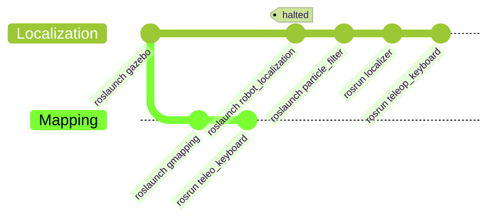

# Mapping-and-Navigation-with-TurtleBot3

## Description
The primary objective of this project is to implement robotics concepts like mapping, localization, path planning, navigation and much more while augmenting the understanding of the ROS environment.

## Status
- At the latest particle filter, one of the methods to achieve localization is being worked upon.
  - The current implementation generates randomized particles within predetermined boundary constraints defined by the map.
  - The pose of each particle is continually updated relative to the robot's pose in relation to the map's origin.

## FlowChart of development

### Description of launch/src files

#### roslaunch gazebo.launch

- The launch file imports an empty world and incorporates obstacles that are defined in the "obstacles.world" file.
- It also uses the **"spawn_model"** node, located inside the gazebo_ros package, to import the robot model of the TurtleBot3 within the Gazebo simulation environment.
- The necessary arguments and parameters are passed to the node to ensure that the robot model is positioned correctly within the simulation environment.
- In the process of **testing the project on a different machine,** a requirement to install the TurtleBot3 packages in advance was encountered. This was due to the models such as walls, boxes being located within the TurtleBot3 package. As a solution, the models were moved inside this project and utilized the GAZEBO_MODEL_PATH environment variable to reference them.

#### roslaunch gmapping
- The gmapping package is utilized to generate a map of the environment.
- The **robot_state_publisher** node is launched to visualize the current position of the robot in the generated map, and to provide the transform of the base_scan to the map frame.
- The gmapping node is initialized with the necessary parameters, and the frame and topic were passed as arguments.

#### roslaunch robot_localization
- In the initial stages of the project, efforts were made to localize the robot within the generated map. However, upon realization that developing the particle filter from scratch would enhance the understanding of ROS, the localization efforts were suspended, and the focus was shifted to the particle filter implementation.

#### roslaunch particle_filter
- The Rviz platform is initialized with predefined settings to facilitate visualization of the localization process.
- The global frame of reference is set by importing the map generated by the gmapping package using the **map_server** package.
- The robot model is imported to visualize the robot's position within the generated map.
- To determine the robot's position relative to the global frame of reference (i.e., the map), the odom frame is updated as the robot moves. By attaching the odom frame to the origin of the map, the robot's motion can be visualized in Rviz.
- To establish the transformation between the map and odom frames, the tf package is employed. The node **static_transform_publisher** is used to set the transform between these frames once, as needed.

#### rosrun localizer
- The program is structured into two sections: the setup and the loop.
- The program functions as a ROS node that subscribes to the "/odom" node to retrieve the robot's current location.
- Additionally, it publishes to two topics, namely **"particle_cloud_PoseArray" and "particle_cloud_Origin",** which receive "PoseArray" data for visualizing the poses of particles.
- The frame of the "PoseArray" is attached to the "map" to connect their tf data.
- Once the frames are attached, the data of each particle is updated with **random poses** with uniform distribution.
- The publishing rate is then set to 50 Hz, and a second delay is given until the system stabilizes.
- During the execution of the node, the pose of each particle is updated according to the robot's pose. Mathematically, the **rotational transform** is applied first, while the **translational transform** is then applied to update the position of the particle with respect to the robot's position. 

## ToDo
- TF frame attached to every single particle should be generated and LaserScan of each associated particle should be updated.
- Once LaserScan of each particle is updated compare it with LaserScan data of robot.
- If the LaserScan data of a particle falls within the predefined threshold, it is retained; otherwise, it is discarded.
- Implement **adaptive mote-carlo localization** by resampling particles after each iteration and reducing the particle count accordingly.